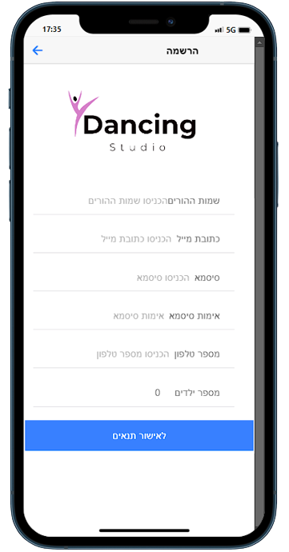

# MyDancingStudioProject
A hybrid application designed for managing and engaging with dancing studios.

## Table of Contents
- [Client Side](#client-side)
  - [Login Page](#login-page)
  - [Register Page](#register-page)
  - [Home Page](#home-page)
- [Manager Side](#manager-side)
  - [Manager Page](#manager-page)
  - [Customer Management](#customer-management)
  - [Courses Management](#courses-management)

---

## Client Side

### Login Page

  
  

The Login Page allows registered users to sign in to their accounts.

### Register Page

  
  

New users can register for an account on this page.

### Home Page

  
  

This is the landing page once the user logs in. Here you can find all the services offered.

---

## Manager Side

### Manager Page

  
  

This is the main dashboard where managers can monitor and control all activities related to the dancing studio.

### Customer Management

  
  

Managers can manage all customer-related data here.

### Courses Management

  
  

All course-related data can be managed here.
